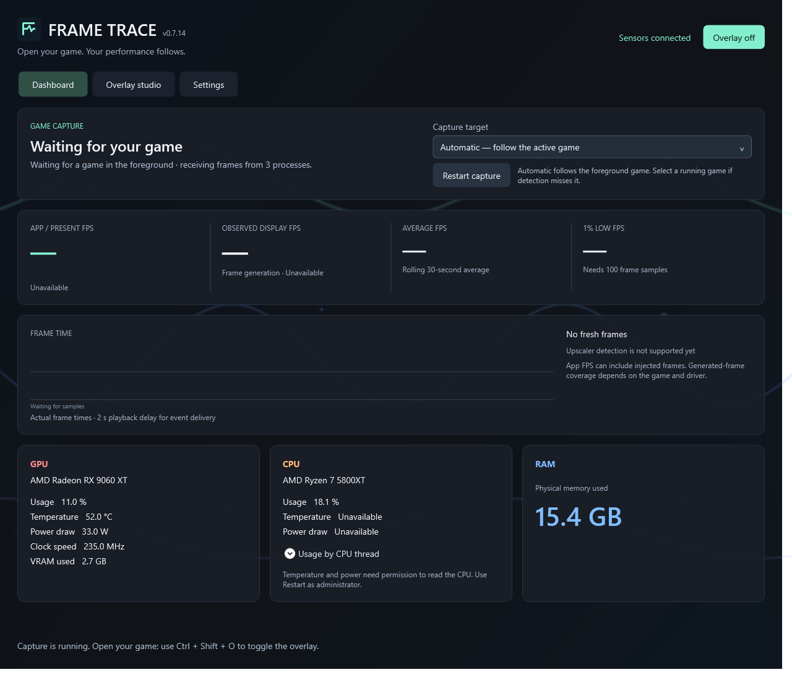
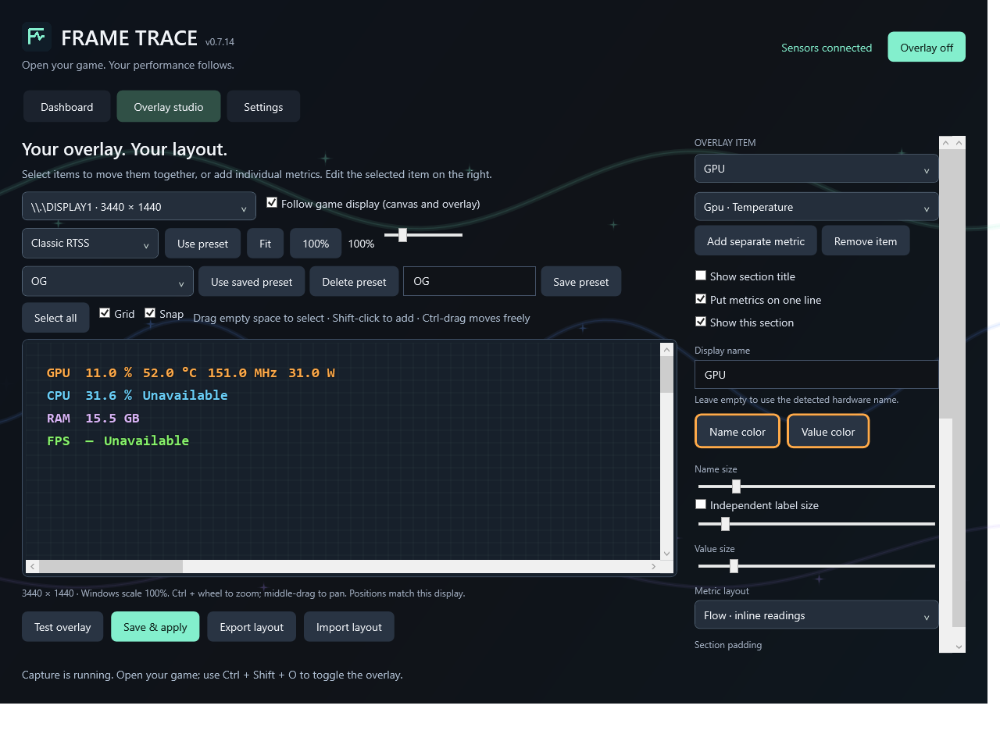
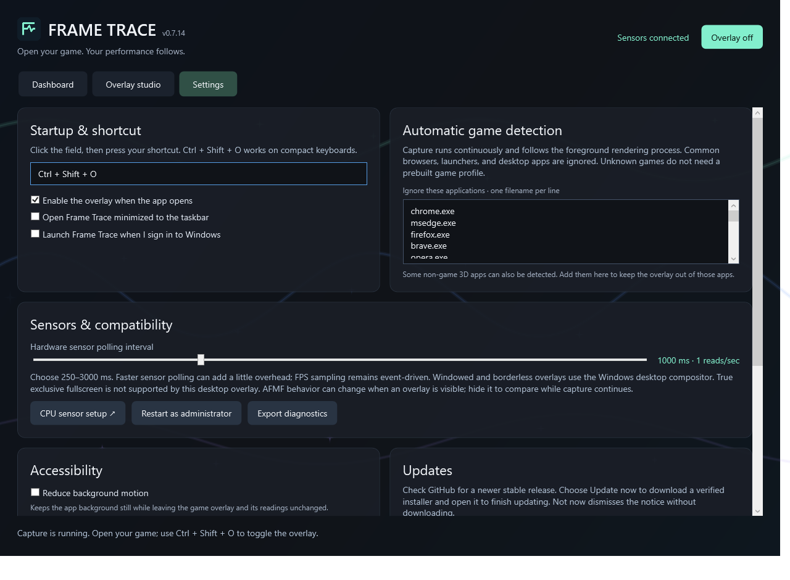
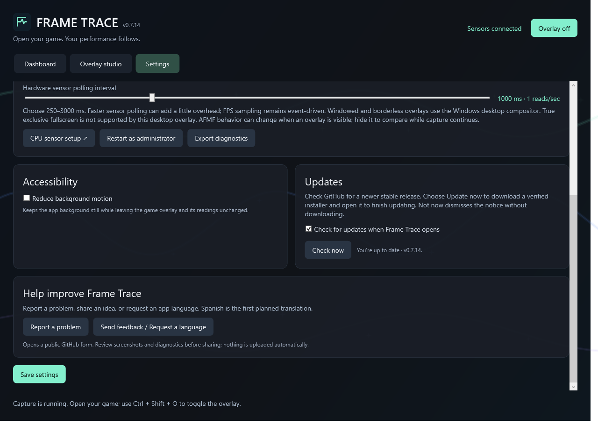

<p align="center"></p>
<h1 align="center">Frame Trace</h1>
<p align="center"><strong>Open your game. Your performance follows.</strong><br>Free, open-source Windows performance dashboard and customizable gaming overlay.</p>
<p align="center"><a href="https://github.com/itourboy-OG/FrameTrace/releases/latest"></a> <a href="LICENSE"></a> </p>

<table>
  <tr>
    <td align="center"><strong>Dashboard</strong><br></td>
    <td align="center"><strong>Overlay Studio</strong><br></td>
  </tr>
  <tr>
    <td align="center" colspan="2"><strong>Settings</strong><br></td>
  </tr>
  <tr>
    <td align="center" colspan="2"><strong>Settings · accessibility, updates and feedback</strong><br></td>
  </tr>
</table>

## Get Frame Trace

Download the Windows x64 installer from [Releases](https://github.com/itourboy-OG/FrameTrace/releases/latest). Frame Trace checks for newer stable releases when it opens (optional) and from **Settings → Check now**. A compact notice offers **Update now** or **Not now**. Update now downloads the installer with percentage progress, verifies its size and SHA-256 against GitHub's release metadata, and opens Windows Setup to finish updating. Frame Trace closes cleanly before installation. Not now dismisses the notice without downloading. Updates never start without your choice.

The installer is unsigned in this early release, so Windows may show a SmartScreen warning. Review the source and release details before installing.

## What works today

- **Automatic capture:** follows the foreground application that is presenting frames. If detection misses a game, select its running process from the dashboard. You do not need to choose an executable file or start capture manually.
- **Frame performance:** app/present FPS, observed display FPS, rolling average, 1% low, frame time, and a live frame-time graph.
- **Hardware readings:** GPU load, temperature, power, clock, and VRAM; CPU load, temperature, and power where the sensor driver exposes them; physical RAM used.
- **Overlay Studio:** drag or group-select items, add separate metrics, rename labels, adjust colors, fonts, sizes, layout, graph dimensions, and opacity. Match the canvas to your monitor, use the grid and snapping, save or delete named presets, and test edits live. An unsaved-edits indicator and confirmation protect edits before loading another preset, importing a layout, or resetting it.
- **Settings:** customize the overlay shortcut and startup state, launch at Windows sign-in, start minimized, reduce background motion, ignore selected processes, adjust sensor polling, and choose whether to check for updates on startup.
- **Updates:** checks the public GitHub Releases API, offers an optional installer download with percentage progress and checksum verification, and starts Windows Setup after you choose Update now. Failed or canceled downloads are not installed. It does not upload performance readings.

The Windows smoke suite passes locally, including real PresentMon capture, sensor reads, settings persistence, process selection, the Overlay Studio, and its five layouts. That does not establish compatibility with every PC or game.

## Known limitations

- **In-game upscaler details are not detected.** DLSS, FSR, XeSS upscaling modes and quality presets, and OptiScaler’s input/output configuration are not reported.
- **Frame generation identification depends on data reported by the capture path.** AFMF 2.1 and Intel XeSS-FG can be identified when PresentMon reports their tags. DLSS frame generation, in-game FSR frame generation, and a guaranteed split between native and generated FPS are not supported. Missing data means unknown, not disabled.
- **True exclusive fullscreen is not supported by the desktop overlay.** Capture may still report frame data. Windowed and borderless games use the Windows desktop compositor; behavior can vary by title and driver.
- **Anti-cheat compatibility has not been certified.** Frame Trace does not inject code into games, but that alone cannot guarantee that every anti-cheat permits an overlay. Competitive-game compatibility and account safety have not been verified; follow each game's rules.
- **Hardware support varies.** Sensor availability depends on the hardware, driver, permissions, and sensor driver. Broader AMD and NVIDIA testing is still needed.
- **The installer is not code-signed.** SmartScreen may require an additional confirmation.

## Settings and privacy

Frame Trace stores preferences locally in `%LOCALAPPDATA%\FrameTrace`. On first startup after an upgrade, it renames the legacy `Frameglass` data folder, preserving preferences, custom presets, and diagnostics. If both folders exist, startup reports the conflict and leaves them unchanged. The update check makes a normal HTTPS request to GitHub for the latest public release; it sends the app's version in the request header and does not send hardware data, game names, or frame readings. Automatic checking can be disabled in Settings; **Check now** remains available.

Installer downloads are saved under `%LOCALAPPDATA%\FrameTrace\Updates` only after you choose **Update now**. Their size and SHA-256 checksum are checked before Windows Setup is opened. Closing Frame Trace during a download cancels it and removes the partial file.

Diagnostics are exported only when you choose **Export diagnostics**. Diagnostic files can include hardware readings, process names, and recent frame data. Review a file before sharing it.

Overlay layout exports share overlay appearance and positions without sharing your hotkey, ignored-app list, Windows startup choice, or update preference. Importing a layout leaves those local settings unchanged.

## Build from source

Requirements: Windows 10 or later, .NET 9 SDK, and Inno Setup 6.

```powershell
./build.ps1
./artifacts/app-0.7.14/FrameTrace.exe --smoke-test C:/path/to/test-results
```

The build creates a self-contained Windows x64 application and per-user installer. It downloads PresentMon 2.6.0 when needed and verifies its SHA-256 before packaging. The smoke test writes a `result.txt` report and screenshots; it uses real local sensors and ETW capture but does not validate every game or anti-cheat.

## Roadmap

- Test capture and overlay behavior across more games, graphics cards, drivers, and display modes.
- Investigate a safe path for true exclusive-fullscreen overlays.
- Explore reliable, cooperative reporting of in-game DLSS, FSR, XeSS, and frame-generation settings.
- Improve the dashboard, accessibility options, and update experience based on player feedback.

## Source and contributions

Frame Trace's source code is licensed under [MIT](LICENSE). Third-party components keep their own licenses; see `vendor/` notices and the packaged `ThirdPartyNotices.txt`.

### Feedback and bug reports

Have an idea, question, or problem to report? [Open a GitHub issue](https://github.com/itourboy-OG/FrameTrace/issues/new/choose) and choose **Bug report** for something that is not working, or **Feedback or language request** for ideas, general feedback, and language requests. Fill in the form and submit it; you do not need to know Git or write code. If you are unsure which option fits, use the feedback form. If someone has already reported the same thing, add a comment to that issue instead.

Inside the app, **Settings → Help improve Frame Trace** opens these forms through **Report a problem** or **Send feedback / Request a language**. Nothing is uploaded automatically.

Issues are public. Do not include passwords, account details, or other private information. A diagnostics file is optional; review it first because it can contain hardware readings, process names, and recent frame data. See [Settings and privacy](#settings-and-privacy) for details.

More app languages may be added based on community interest. **Spanish is the first planned translation.** Use the feedback form to request another language or offer help with a translation.

Pull requests are welcome from people who want to propose code changes, but they are not required to report a problem or share feedback.
